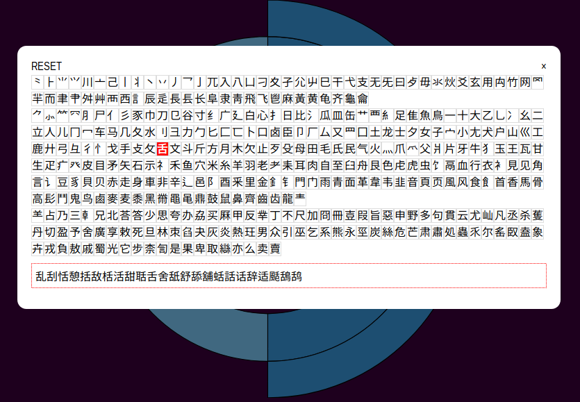

# Chinese logogram analysis

This application displays a phonosemantogram components analysis by using tree, taxogrid and radial diagrams.

All chinese characters are **logograms** (graphemes related directly to words, and not to ideas or images). They originated as primitive pictograms or ideograms, however most of them were designed as units composed from a phonetic and a semantic component which are named phonosemantograms.

This application was designed to visualize phonosemantograms recursivity. For instance, it has been observed from the database that four phonosemantograms ([礴](https://alerojorela.neocities.org/writing/chineseGraphemes/analysis.html?q=礴), [臟](https://alerojorela.neocities.org/writing/chineseGraphemes/analysis.html?q=臟), [蘩](https://alerojorela.neocities.org/writing/chineseGraphemes/analysis.html?q=蘩) & [蠮](https://alerojorela.neocities.org/writing/chineseGraphemes/analysis.html?q=蠮)) have the maximum nesting level found in chinese phonosemantograms: four.

fig.  [蠮](https://alerojorela.neocities.org/writing/ChineseGraphemes/analysis.html?q=蠮) (bee)

## Interface

This is the color key for semantic  and phonetic components

fig. Navigator tab renders an interactive (by using d3.js) radial diagram. Shows descendants too, but also ancestors (logograms that contains the selected one)

fig. upwards composition: phonosemantograms that contains 見 (to see)

Click over current logogram to browse logograms by radicals and by semantic components

## Sources

<a href="SOURCES.txt">See sources</a>

## To-do

Improve text scaling

Add an example tab to show sentences related to logogram components

Get orientation data: ⿰ or ⿱

Improve logogram selector: multiselection

------

2019 Alejandro Rojo Gualix

CC BY-NC Attribution & Non-commercial
