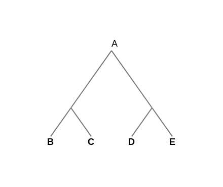
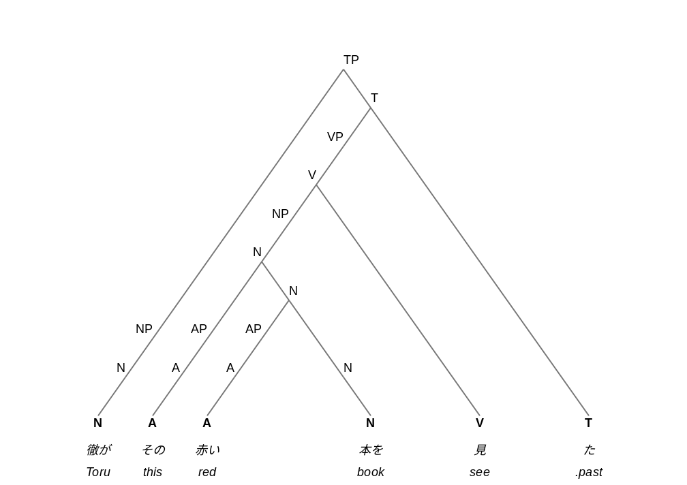
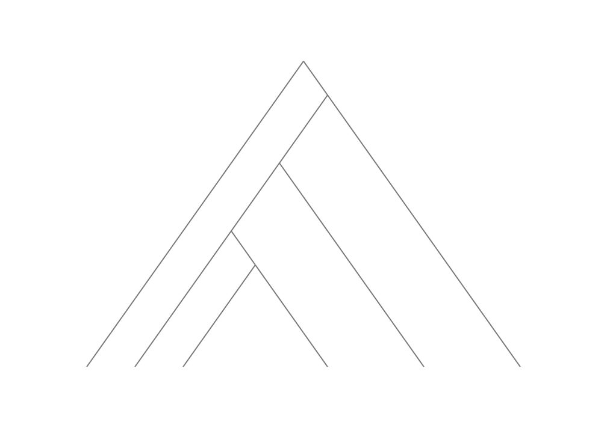
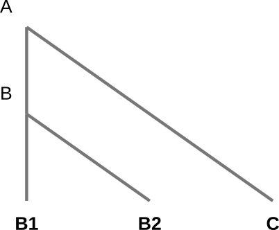

# Binary division diagram

This app renders a tree diagram of a recursive **binary structure**. No more than two children per node are allowed. It has a distinctive formalism based on triangles.


[A [ [B] [C]] [ [D] [E]]]




## Samples




[TP [NP [N [N 徹が Toru]]] [T [VP [V [NP [N [AP [A [A その this]]] [N [AP [A [A 赤い red]]] [N [N 本を book]]]]] [V 見 see]]] [T た .past]]]


You can remove all the tags and get the raw structure `[ [ [ []]] [ [ [ [ [ [ [ []]] [ [ [ []]] [ []]]]] []]] []]] `




## Basis

ParseGrid() creates an x-y grid that later distorts into an equilateral triangle. Terminal nodes are always positioned on horizontal axis, y=0.




## Grammar

### Reserved characters

+ brackets `[ ]` represent hierarchy,
+ space separates tokens,
+ quotation marks `" "` or `« »` group tokens that contain spaces.

### Parser 

It uses a PEG grammar:

```
expression = _? "[" _? (token _?)* (expression _?)* "]"  

token = "«" s:nonreservedchar* "»"
        / "\"" s:nonreservedchar* "\""
        / s:nonreservednonwhitespacechar+

nonreservednonwhitespacechar = [^ \t\n\r\[\]\"«»]
nonreservedchar = [^\[\]\"«»]
reservedchar = [\[\]\"«»]
_ "whitespace" = [ \t\n\r]+
```


Every branch is recursive and made up of `[tags* subbranch1? subbranch2?]`. Tags are not allowed to be placed between branches. The first tag is the main one and the rest are annotations.

e.g.

* [PP [Prep to] [NP «the house»]]
* [NP [N house]]


## Todo

Fitted text size

Fitted annotations

Implement edition


------

2019 Alejandro Rojo Gualix

CC BY-NC Attribution & Non-commercial